<p align="center">
    <a href="https://datadrivenconstruction.io"> 
  
      </a>
</p>

# 🚀 CAD-(BIM)-to-Code Automation Pipeline with LLM (ChatGPT)

**Revit (.rvt), AutoCAD (.dwg), IFC, MicroStation (.dgn) → Excel + AI-Generated Python Analysis — no Autodesk® or openBIM tools required**

> 🔄 Built for fully offline workflows using [n8n](https://n8n.io) + [DataDrivenConstruction Converters](https://cadbimconverter.com)

---

## 🛠 Features

- 🔄 Convert `.rvt`, `.ifc`, `.dwg` to:
  - 📊 Excel (element data as a matrix - project elements in the rows, all properties of all elements in the columns))
  - 🧱 Polygonal geometry (only Revit and IFC) into an open geometric format `.dae` (Collada) 
  - 📋 Schedules (only for Revit)
  - 📄 Drawing Sheets (PDF) (only for Revit)
- ✅ Quality Control with validation rules
- 🤖 Ask AI to generate custom Python code
- 📈 Instantly get charts, stats, summaries from your model

---

## 📦 Installation Guide


### 1. Install `n8n` on Windows

Before installing n8n, make sure **Node.js** (which includes `npm`) is installed:

- Download from: [https://nodejs.org/en/download](https://nodejs.org/en/download)

```bash & cmd
npx install -g n8n
n8n start
```
or
``` bash & cmd
npx n8n
```

Or download desktop app: [n8n.io/download](https://n8n.io/download)

### 2. Download Converters

| Format                | Converter         | Download |
|-----------------------|-------------------|----------|
| Revit (.rvt)          | `RvtExporter.exe` | [Download](https://cadbimconverter.com/convertors/) |
| IFC                   | `IfcExporter.exe` | [Download](https://cadbimconverter.com/convertors/) |
| AutoCAD (.dwg)        | `DwgExporter.exe` | [Download](https://cadbimconverter.com/convertors/) |
| MicroStation (.dgn)   | `DgnExporter.exe` | [Download](https://cadbimconverter.com/convertors/) |

---

## ⚙️ Quick Setup

1. Clone or import the workflow:  
   [⬇ Download JSON file](./CAD_BIM_to_Code_Automation_Pipeline_DDC_Workflow.json)

2. In **n8n**, import the workflow via "Import from file".

3. Configure paths:
   - Set absolute path to `RvtExporter.exe` in the `$INPUTS$` node.
   - Example:
     ```
     C:\out\DDC-Converters\RvtExporter.exe
     ```

---

## 🎯 Workflow Overview

```mermaid
graph TD;
    A[📋 Upload RVT/IFC/DWG/DGN file] --> B[📁 Create Workspace]
    B --> C[⚙️ Run Pipeline-Converter]
    C --> D{✅ Success?}
    D -->|Yes| E[📥 Read Excel, PDFs, Schedules]
    D -->|No| F[❌ Show Error]
    E --> G[🔍 Validate with Excel Rules]
    G --> H[🤖 AI Code Generator]
    H --> I[📊 Charts, Stats, Python Output]
```



---

## 💬 Example Use

- Upload your `.rvt` file
- Choose options: _sheets_, _schedules_, _bounding box_
- AI understands your prompt:

> “Group by `Type Name`, sum `Volume`, and show a bar chart.”

You'll get the result instantly — no coding needed.

---

## 📎 Extras

- 📘 Validation template: [DDC Revit & IFC Validation Table](https://github.com/datadrivenconstruction/Revit-IFC-Verification/raw/main/DDC%20Revit%20and%20IFC%20Validation.xlsx)
- 📊 Example AI-generated outputs: grouped tables, bar plots, summaries

---

## 🧠 Powered by

- [`n8n`](https://n8n.io/)
- [`DataDrivenConstruction.io`](https://datadrivenconstruction.io)
- Offline `.exe` converters (no Autodesk® tools required)

---

## 🛟 Support

Need help or ideas for automation?  
Visit 👉 [https://datadrivenconstruction.io](https://datadrivenconstruction.io) or open an issue in this repo.


<p align="center">
  <a href="https://datadrivenconstruction.io"> 
  
  </a>
</p>
